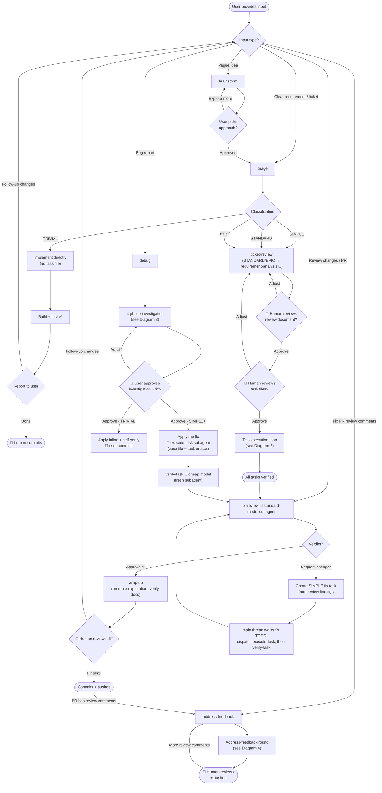
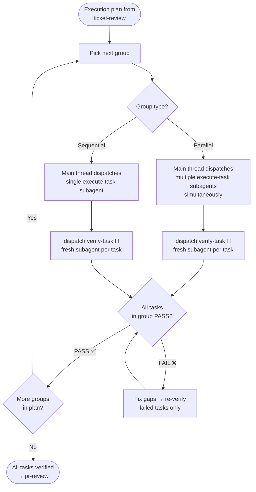
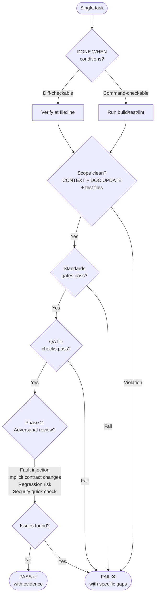
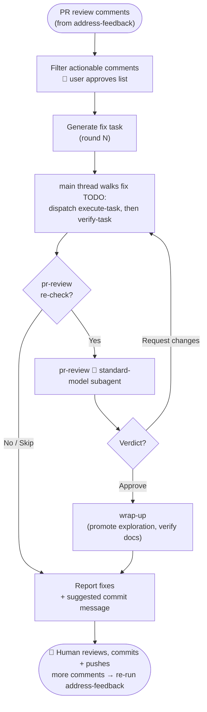
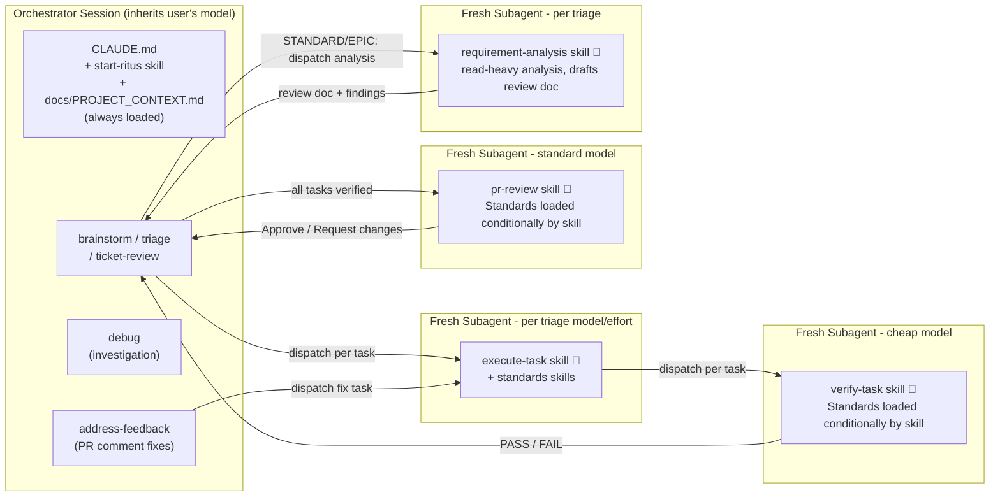
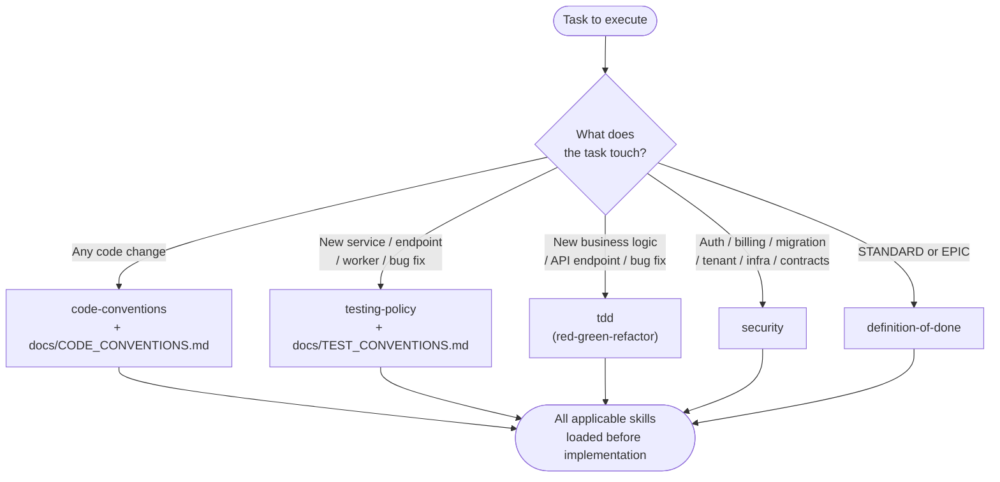
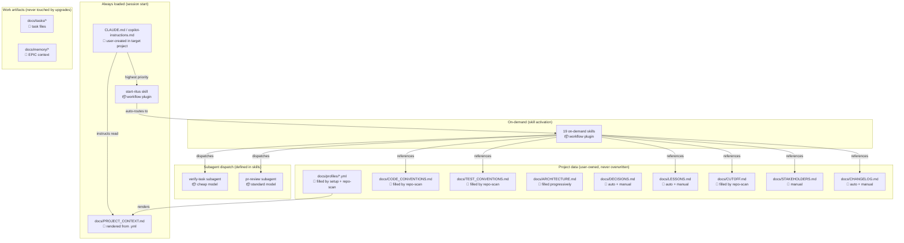

# Workflow Diagrams

> **AI agents: do NOT read this file during workflow execution.** These diagrams are for human
> onboarding and reference only. The authoritative process lives in the skill files - follow those.

Visual reference for the Ritus workflow process. All diagrams use Mermaid syntax.

## 1. Main Workflow

Entry points, triage branches, and the path to completion.

**Legend:** 🧑 = human-in-the-loop gate. 🤖 = runs as a dedicated subagent with specified model.

## 2. Task Execution Loop

The execute → verify cycle with parallel group support and retry on failure.

### Verify-task detail (per task)

## 3. Debug Investigation Flow

4-phase investigation before any fix attempt.

```mermaid
flowchart TD
    Bug([Bug reported]) --> P1

    subgraph "Phase 1 - Root Cause Investigation (hard gate)"
        P1["Read error messages\nstack traces, line numbers"]
        P1 --> P1b["Reproduce the bug\nconfirm exact conditions"]
        P1b --> P1c["Check recent changes\ngit log + git diff"]
        P1c --> P1d["Gather evidence at\ncomponent boundaries"]
        P1d --> P1e["Trace data flow\nbackward from bad value"]
        P1e --> RCGrade{"Root cause\nconfidence?"}
        RCGrade -->|"Confirmed"| P2
        RCGrade -->|"Deduced"| P2
        RCGrade -->|"Hypothesized"| P1f["Gather more evidence\nbefore proceeding"]
        P1f --> P1
    end

    subgraph "Phase 2 - Pattern Analysis (hard gate)"
        P2["Find working examples\nin same codebase"]
        P2 --> P2b["Compare working vs broken\nline by line"]
        P2b --> P2c["Identify differences\n+ map dependencies"]
    end

    P2c --> P3

    subgraph "Phase 3 - Hypothesis & Testing (hard gate)"
        P3["Form single hypothesis\nclearly stated, specific"]
        P3 --> P3b["Test minimally\none variable at a time"]
        P3b --> P3c{"Hypothesis\nconfirmed?"}
        P3c -->|"Yes"| ProposedFix["Proposed fix + regression test\n(root cause confirmed)"]
        P3c -->|"No"| P3d["New hypothesis\ndo NOT layer fixes"]
        P3d --> P3
    end

    ProposedFix --> DBInvestigationApproval{"🧑 User approves\nproposed fix?"}
    DBInvestigationApproval -->|"Adjust"| P3
    DBInvestigationApproval -->|"Approve"| Size{"Fix size?\n(triage criteria)"}
    Size -->|"TRIVIAL"| Inline["Apply inline + self-verify\n(build + test)"]
    Inline --> TrivDone(["Report - 🧑 user commits\n(commit message = root cause)"])
    Size -->|"SIMPLE+"| P4

    subgraph "Phase 4 - SIMPLE+: case file, then dispatch the fix"
        P4["Write investigation case file\nProposed Fix = STEPS · Regression Test = DONE WHEN"]
        P4 --> P4b["Apply the fix\n🤖 execute-task subagent (tdd red-green)"]
        P4b --> P4c["Verify\n🤖 verify-task subagent (fresh, independent)"]
        P4c --> P4d{"PASS?"}
        P4d -->|"FAIL"| Escalation{"Circuit breaker\ntripped?"}
        Escalation -->|"No"| P4b
        Escalation -->|"Yes"| Stop(["🧑 STOP - architectural problem\nwrite DECISION, discuss with user"])
    end

    P4d -->|"PASS"| CR(["→ pr-review\n🤖 standard-model subagent"])
```

## 4. Address-Feedback Round

The PR-feedback fix round: filter comments, fix, verify, optionally re-review, then report the fixes for the user to review and commit locally.

**Legend:** 🧑 = human-in-the-loop gate. 🤖 = runs as a dedicated subagent with specified model.

## 5. Context and Model Architecture

What runs in which context, with which model.

## 6. Standards Loading Matrix

Which standard skills load for which types of work.

## 7. File Ownership and Loading

What loads when, and who owns each file.

**Legend:** 🧑 user-owned (preserved on upgrade) · 📦 workflow package (replaced on upgrade) · 🔄 rendered · 📝 work artifacts
